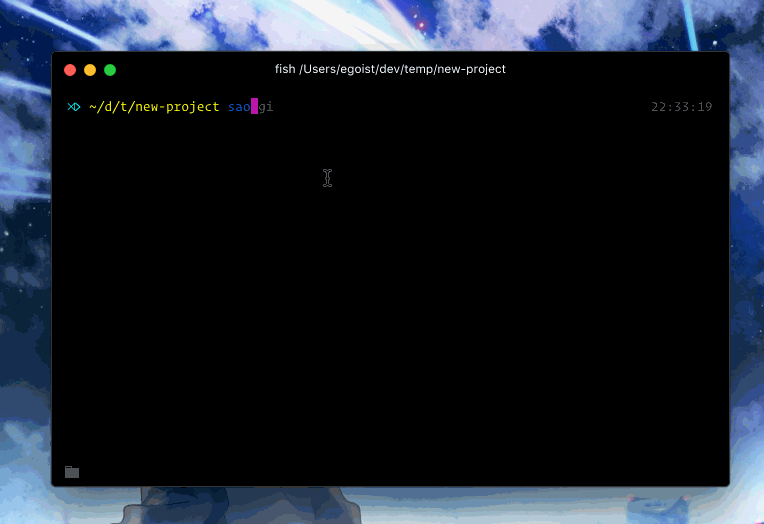

# gitignore

Generate `.gitignore` file in your project.



## Usage

```bash
cd your-project
sao gi
```

Check out [sao](https://github.com/egoist/sao) if you don't know what it is.

## Available gitignore types

- default
- gitbook

Check out [./template](./template) for more details, you can send Pull Request to add more types!


## License

MIT &copy; EGOIST